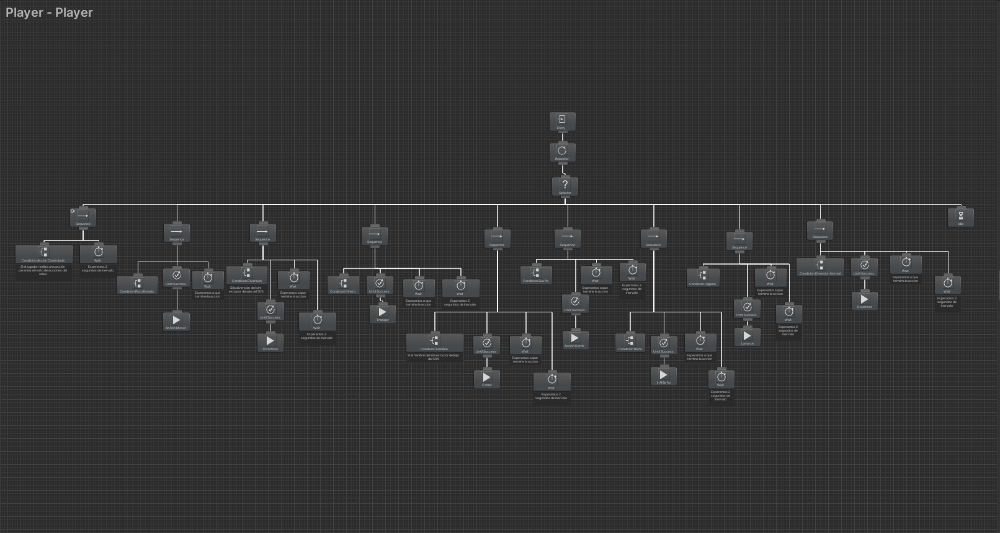
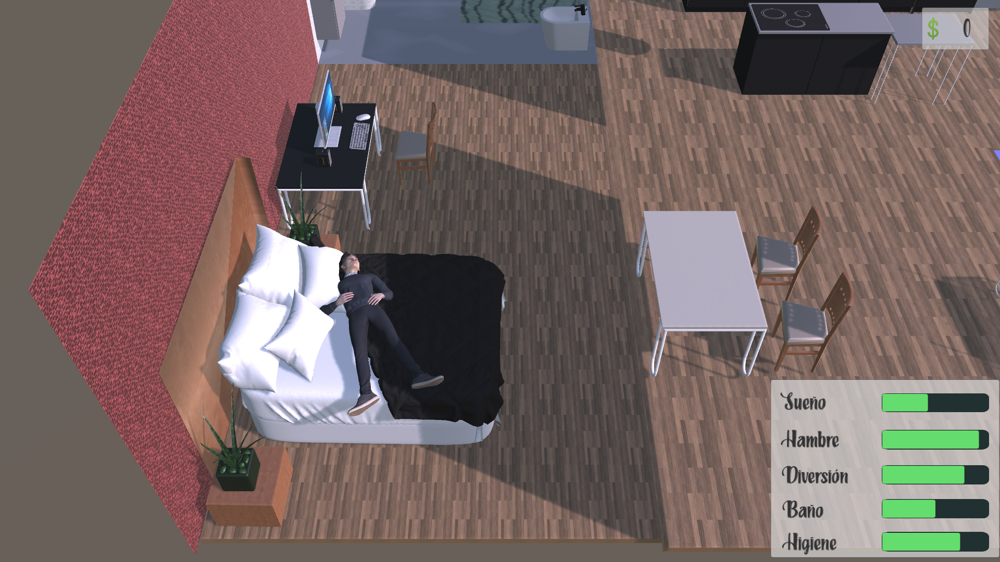
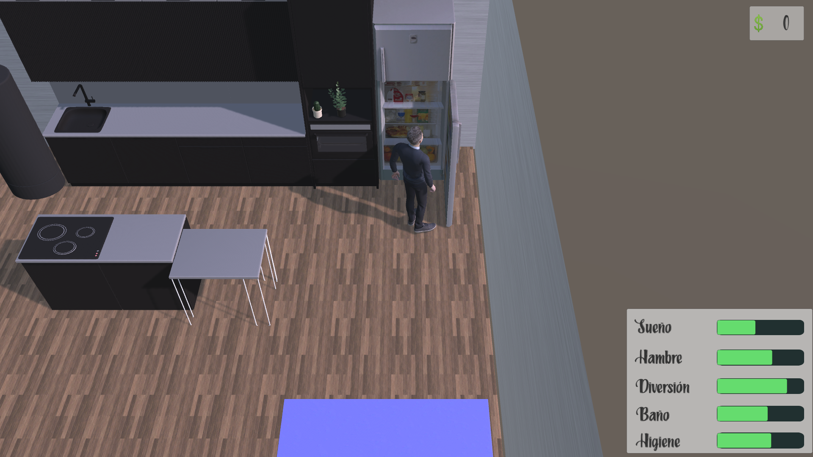

# IA Proyecto Final - Prototipo de Los Sims
_Sandra Mondragón Lázaro_

* [Vídeo](https://drive.google.com/file/d/1njvJLcsTY86o6CfP7B2nyGWn5TLk_M8M/view?usp=sharing)
* [Build](https://drive.google.com/file/d/1XWKMFxJV_5CHYaYFPzRZHo3eJYveRHeO/view?usp=sharing)
> El prototipo que se va a desarrollar constará de un entorno interactuable. Este entorno podrá ser 
clicable por con él, con el fin de poder usar las funciones que le permitan los objetos del entorno 
y que el sim realice la acción que el jugador decida.  
Además de esto, si el jugador decide no realizar ninguna acción, el sim procederá a hacer alguna 
dependiendo de sus estadísticas o como se encuentre en el momento.  
Para la Inteligencia Artificial del sim se usarán árboles de comportamiento. Además se 
complementará con la búsqueda de caminos mediante mallas de navegación, los comportamientos 
de dirección y hasta la gestión sensorial.  

### _ACCIONES DEL JUGADOR_
* **Mover la cámara**con el fin de ver mejor la escena, el jugador puede mover la cáamra con las teclas W,A,S,D
* **Interactuar**: con los objetos que aparezcan en la escena. Entre ellos encontramos objetos como:  
	●	 Dispensador de comida: Referente a objetos que proporcionen comida al sim. Pueden ser de mejor o peor calidad, proporcionando mayor o menor nivel de alimentación. Por 
ejemplo: nevera, microondas, horno, etc. Si el sim se alimenta su hambre disminuye.    
	● Objeto de diversión: Referente a aquellos objetos que le puedan proporcionar diversión al sim: televisión, ordenador, hacer deporte.  
	● Objeto de higiene: Referente a aquellos objetos que le proporcionen higiene al sim como duchas o bañeras. Pueden ser de mejor o peor calidad.  
	● Retrete: Objeto para que el sim desahogue sus ganas de ir al baño.  
	
	Interactuar con los objetos de la escecena hace que el agente realice las acciones correspondientes.
### _EL AGENTE_
Consta de constantes vitales, las cuales son **hambre, sueño, diversión, higiene y baño**. En caso de que la diversión o el hambre sean menores que 0 el agente morirá. En caso
de que las constantes de sueño o higiene pasen a ser menores que 0 la resta constante por segundo será mayor, haciendo que sea más dificil sobrevivir. Si la constante de baño 
baja de 0, el sim se meará en el propio sitio(mostrando un charco en el suelo) y su higiene será restada drásticamente).  
Sus constantes se verás reflejadas por barras las cuales disminuirán o aumentarán con el paso del tiempo de pendiendo de las acciones que el sim realice. Además de esto, el
agente consta de dinero con el fin de poder comprar comida para alimentarse.  
### _EL ÁRBOL DE COMPORTAMIENTO_
El árbol de comportamiento funciona de la siguiente manera. Primero se prioriza si hay una acción que haya realizado el jugador. En caso de que no la haya verá si alguna 
estadística del agente se encuentra por debajo del 30%. Si es el caso realizará la acción correspondiente. En caso de que no haya ninguna por debajo del 30% irá siguiendo 
el siguiente orden si alguna está por debajo del 50%: Diversión, Hambre, Sueño, Baño e Higiene.  En el caso de que sus estadísticas estén por encima del 50% el agente irá 
a divertirse.  
   
### _EL ESCENARIO_  
   
   
### _PRUEBAS_
* [Vídeo 5 minutos( a cámara rápida) agente vive de forma independiente](https://drive.google.com/file/d/1DQqnhtARg2hdkqHDbG13G805c_Mof6NX/view?usp=sharing)
